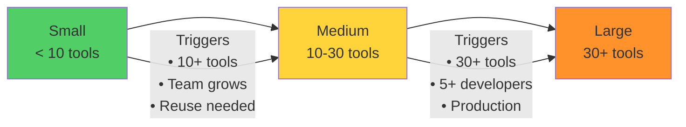
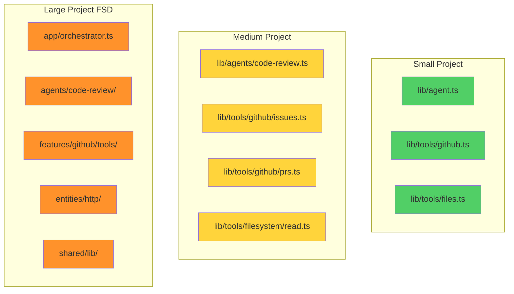
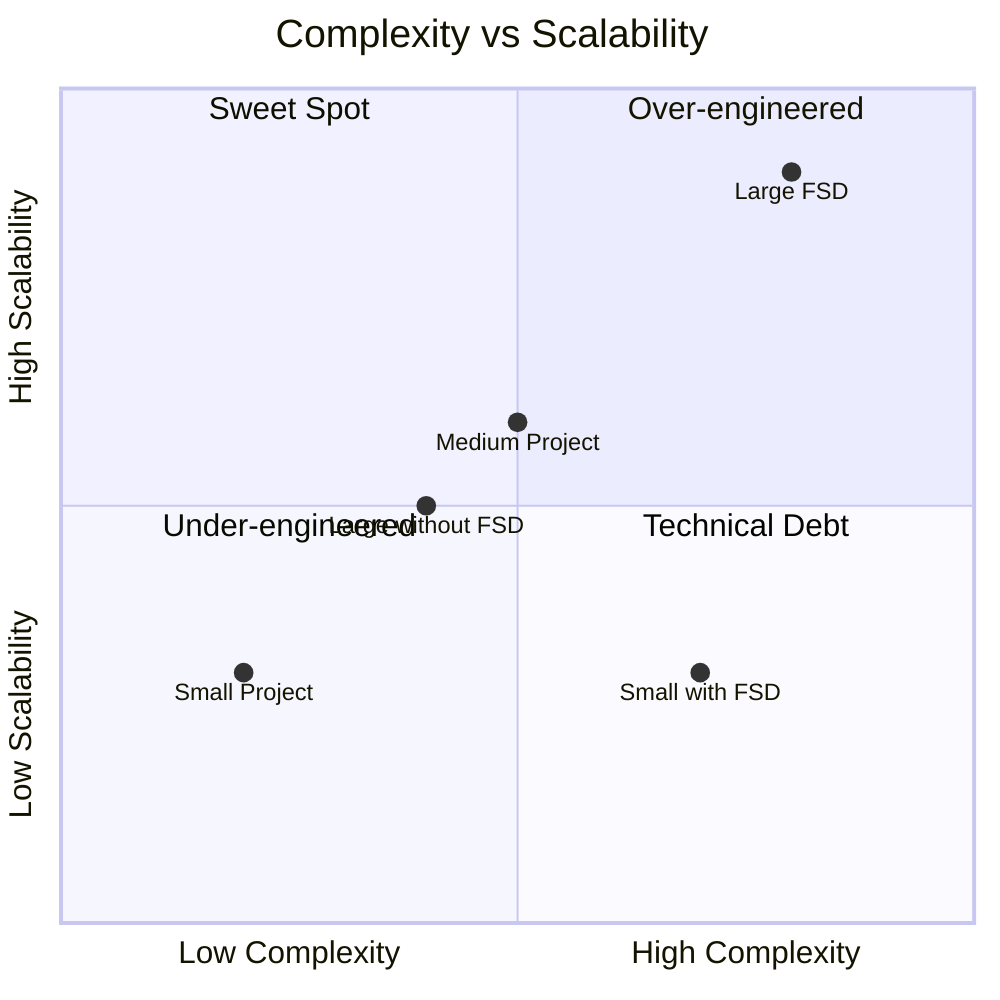
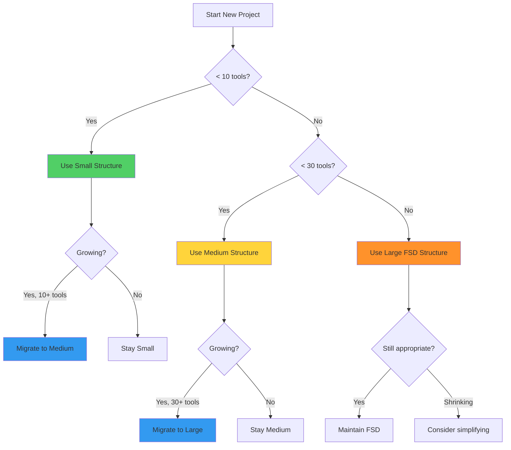
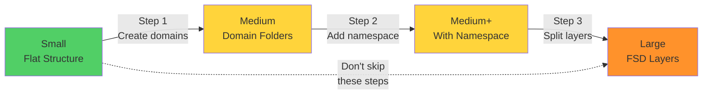

# Architecture Comparison

## Project Size Evolution



## Structure Comparison



## Feature Matrix

| Feature | Small | Medium | Large |
|---------|-------|--------|-------|
| **Tools** | < 10 | 10-30 | 30+ |
| **Agents** | 1-2 | 2-5 | 5+ |
| **Team Size** | 1 | 2-5 | 5+ |
| **Folder Structure** | Flat | Domain-based | FSD layers |
| **Namespace** | ❌ | ✅ | ✅ Required |
| **Import Rules** | ❌ | Optional | ✅ Enforced |
| **Path Aliases** | ❌ | ✅ | ✅ Required |
| **Testing** | Optional | ✅ | ✅ Required |
| **Documentation** | README | Docs folder | Architecture docs |
| **Monorepo** | ❌ | Optional | Consider |
| **Observability** | Console logs | Logger | Tracing + Metrics |
| **Error Handling** | Basic try-catch | Structured errors | Error hierarchy |

## Complexity vs Scalability



## Decision Tree



## Organization Patterns

### Small Project Pattern

```typescript
lib/
├── agent.ts              // Single agent
└── tools/
    ├── github.ts         // All GitHub tools (3-4)
    ├── files.ts          // All file tools (2-3)
    └── index.ts          // Export all
```

### Medium Project Pattern

```typescript
lib/
├── agents/
│   ├── code-review.ts    // Specific agents
│   └── test-runner.ts
└── tools/
    ├── github/           // Domain folders
    │   ├── issues.ts     // Grouped by function
    │   ├── prs.ts
    │   └── index.ts      // Namespace export
    └── filesystem/
```

### Large Project Pattern (FSD)

```typescript
src/
├── app/                  // 🔴 Orchestration
├── agents/               // 🟠 High-level
├── features/             // 🟡 Domain tools
├── entities/             // 🟢 Primitives
└── shared/               // 🔵 Utilities
```

## Migration Path



## When to Choose Each

### Choose Small When:
- ✅ Pet project / Learning
- ✅ MVP / POC
- ✅ Solo developer
- ✅ < 10 tools
- ✅ Single use case

### Choose Medium When:
- ✅ Startup product
- ✅ Internal tool
- ✅ Team 2-5 developers
- ✅ 10-30 tools
- ✅ Multiple use cases

### Choose Large (FSD) When:
- ✅ Production SaaS
- ✅ Enterprise application
- ✅ Team 5+ developers
- ✅ 30+ tools
- ✅ High maintainability needs
- ✅ Multiple products/services
