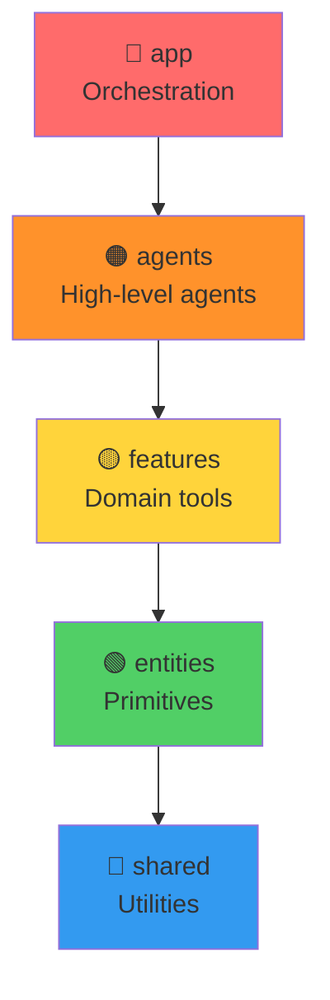
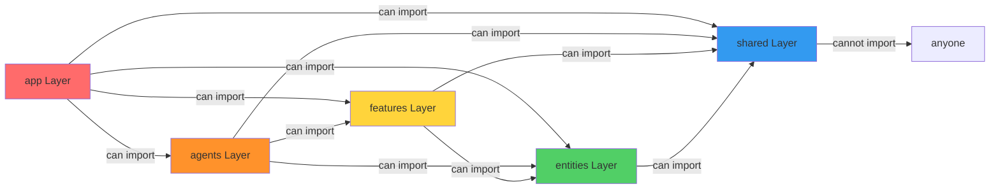
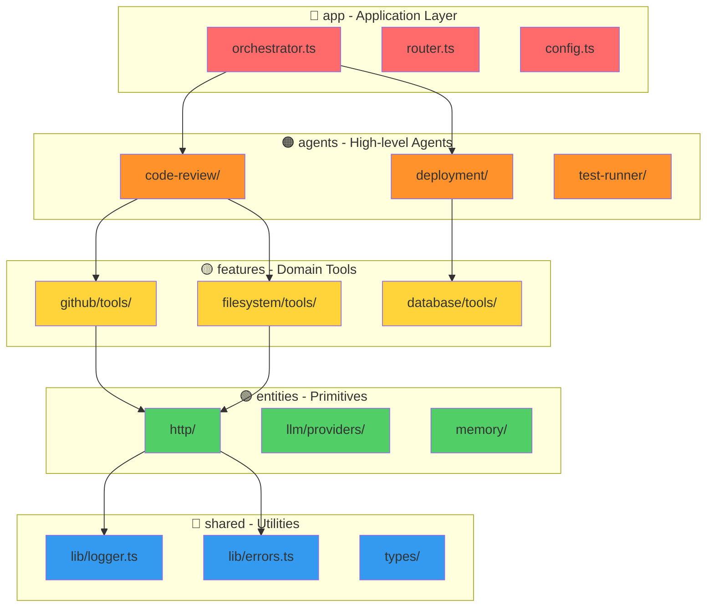
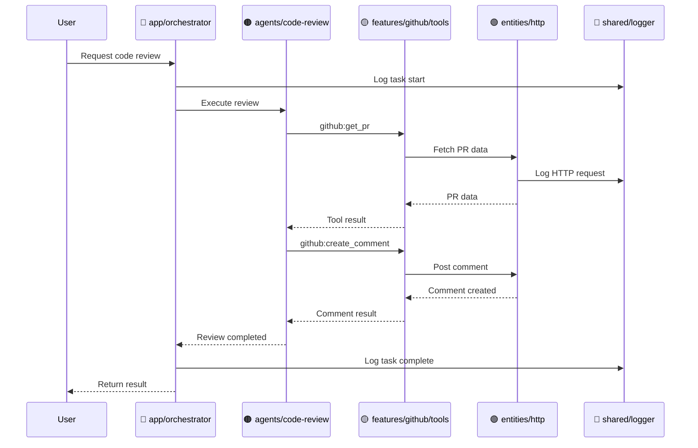

# FSD Layers Visualization

## Layer Architecture

## Import Dependencies

## Detailed Structure

## Data Flow Example

## Layer Responsibilities

| Layer | Responsibility | Can Import | Examples |
|-------|---------------|-----------|----------|
| 🔴 **app** | Orchestration, routing | All layers | orchestrator, config |
| 🟠 **agents** | High-level task execution | features, entities, shared | code-review, deployment |
| 🟡 **features** | Domain-specific tools | entities, shared | github/tools, database/tools |
| 🟢 **entities** | Low-level primitives | shared | http, llm, memory |
| 🔵 **shared** | Utilities | None | logger, errors, types |
