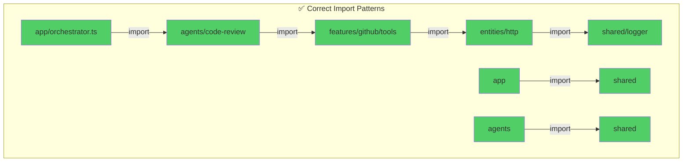
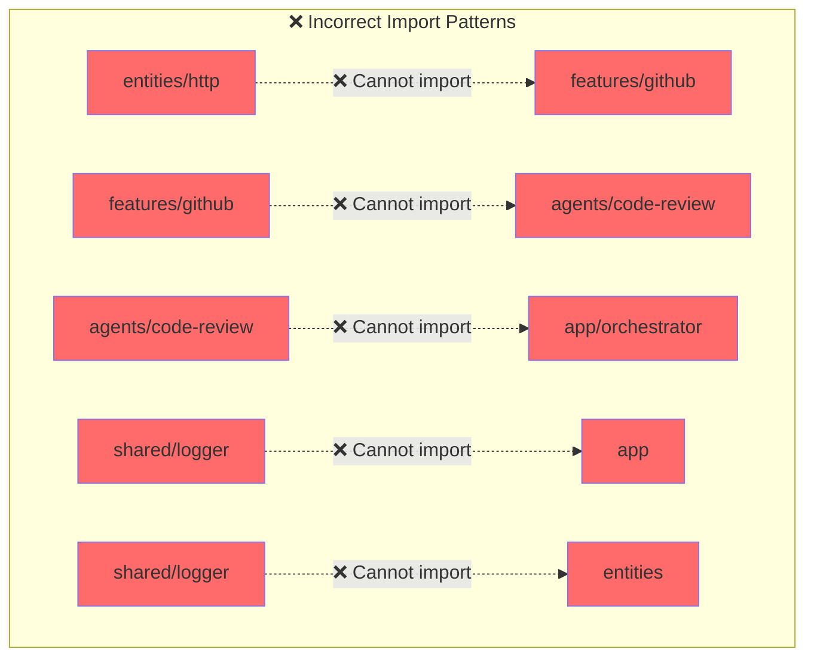

# Import Rules

## Allowed Imports (✅)



### Examples of Correct Imports

```typescript
// ✅ app can import agents
// app/orchestrator.ts
import { codeReviewAgent } from '@/agents/code-review';

// ✅ agents can import features
// agents/code-review/index.ts
import { githubTools } from '@/features/github/tools';

// ✅ features can import entities
// features/github/tools/create-issue.ts
import { httpFetch } from '@/entities/http';

// ✅ entities can import shared
// entities/http/index.ts
import { logger } from '@/shared/lib/logger';

// ✅ Any layer can import shared
// app/orchestrator.ts
import { AppError } from '@/shared/lib/errors';
```

## Forbidden Imports (❌)



### Examples of Incorrect Imports

```typescript
// ❌ entities cannot import features
// entities/http/index.ts
import { createIssueTool } from '@/features/github/tools'; // WRONG!

// ❌ features cannot import agents
// features/github/tools/create-issue.ts
import { codeReviewAgent } from '@/agents/code-review'; // WRONG!

// ❌ agents cannot import app
// agents/code-review/index.ts
import { orchestrateTask } from '@/app/orchestrator'; // WRONG!

// ❌ shared cannot import anything
// shared/lib/logger.ts
import { httpFetch } from '@/entities/http'; // WRONG!

// ❌ Cross-agent imports are forbidden
// agents/code-review/index.ts
import { deploymentAgent } from '@/agents/deployment'; // WRONG!
```

## Enforcing Rules with ESLint

```javascript
// .eslintrc.js
module.exports = {
  rules: {
    'no-restricted-imports': [
      'error',
      {
        patterns: [
          // Entities cannot import features, agents, app
          {
            group: ['@/features/*', '@/agents/*', '@/app/*'],
            message: 'Entities can only import from entities and shared',
          },
          // Features cannot import agents, app
          {
            group: ['@/agents/*', '@/app/*'],
            message: 'Features can only import from features, entities, and shared',
          },
          // Agents cannot import app or other agents
          {
            group: ['@/app/*', '@/agents/*'],
            message: 'Agents can only import from features, entities, and shared',
          },
          // Shared cannot import anything
          {
            group: ['@/app/*', '@/agents/*', '@/features/*', '@/entities/*'],
            message: 'Shared layer cannot import from other layers',
          },
        ],
      },
    ],
  },
};
```

## Import Rule Matrix

| From ↓ / To → | app | agents | features | entities | shared |
|---------------|-----|--------|----------|----------|--------|
| **app** | ❌ | ✅ | ✅ | ✅ | ✅ |
| **agents** | ❌ | ❌ | ✅ | ✅ | ✅ |
| **features** | ❌ | ❌ | ❌ | ✅ | ✅ |
| **entities** | ❌ | ❌ | ❌ | ❌ | ✅ |
| **shared** | ❌ | ❌ | ❌ | ❌ | ❌ |

**Legend:**
- ✅ = Can import
- ❌ = Cannot import

## Why These Rules?

### 1. **Prevent Circular Dependencies**

```
❌ BAD: Circular dependency
features/github → entities/http → features/github
```

### 2. **Maintain Clear Hierarchy**

```
✅ GOOD: Clear top-down flow
app → agents → features → entities → shared
```

### 3. **Enable Independent Testing**

```typescript
// Can test entities/http without mocking features
describe('httpFetch', () => {
  // No dependencies on higher layers
});
```

### 4. **Improve Reusability**

```typescript
// shared/logger can be used anywhere without circular deps
import { logger } from '@/shared/lib/logger';
```

### 5. **Simplify Refactoring**

```
Changing entities/http only affects:
- features (that use it)
- agents (indirectly)
- app (indirectly)

Does NOT affect:
- shared (no dependencies on entities)
```
