# Open-Source Giants Comparison

## Project Overview

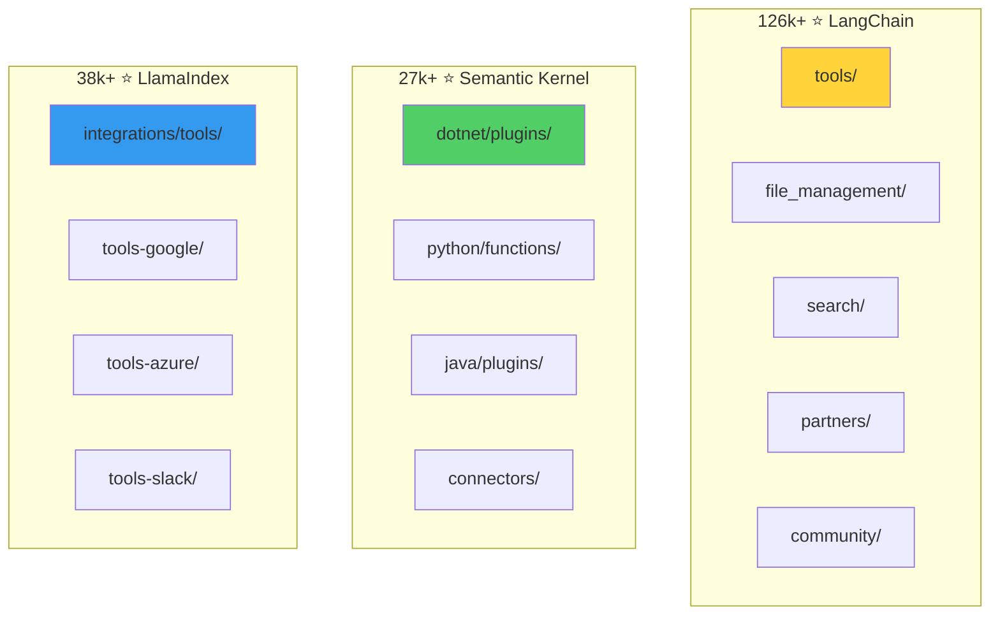

## Organization Patterns

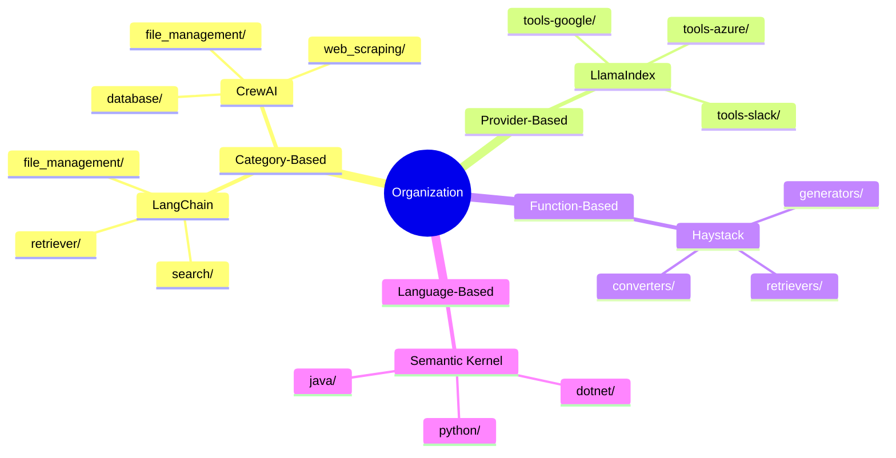

## Terminology Comparison

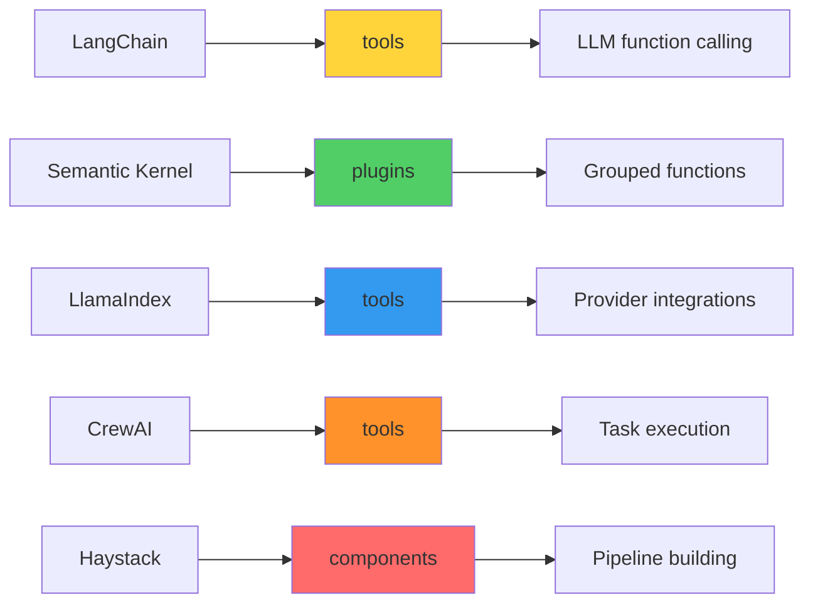

## Monorepo Patterns

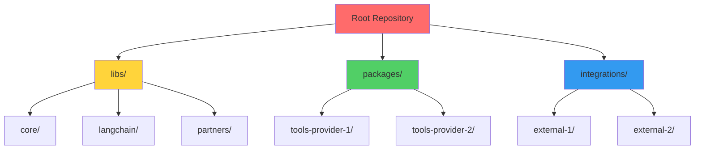

## Scalability Path

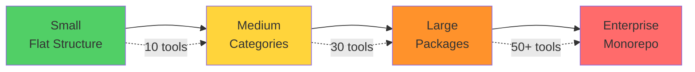

## Integration Strategies

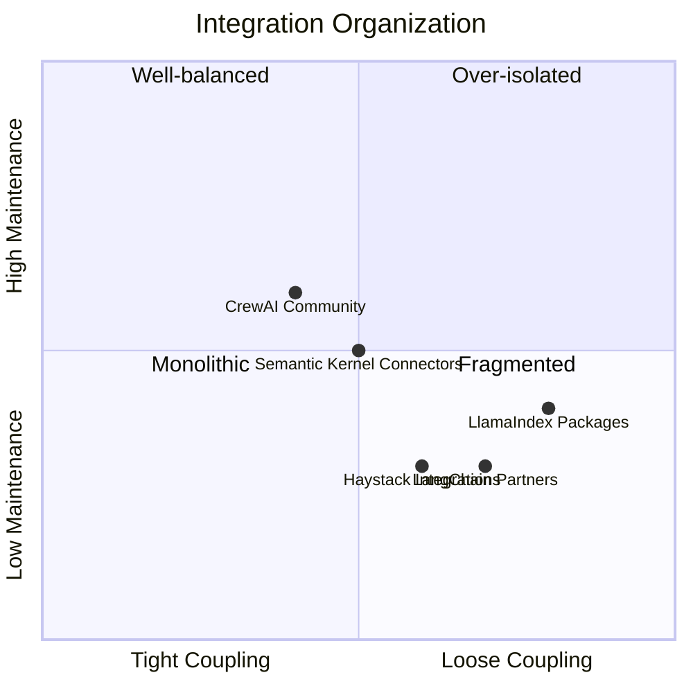

## Naming Conventions

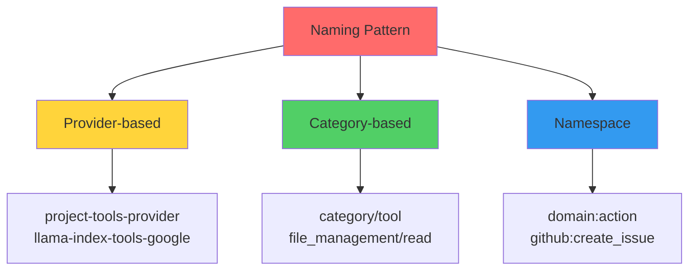

## Common Features Matrix

| Feature | LangChain | Semantic Kernel | LlamaIndex | CrewAI | Haystack |
|---------|-----------|-----------------|------------|--------|----------|
| **Monorepo** | ✅ | ✅ | ✅ | ✅ | ✅ |
| **Categories** | ✅ | ❌ | ❌ | ✅ | ✅ |
| **Providers** | ✅ | ✅ | ✅ | ❌ | ✅ |
| **Separate Integrations** | ✅ | ✅ | ✅ | ❌ | ✅ |
| **Multi-language** | ❌ | ✅ | ❌ | ❌ | ❌ |
| **Deprecation Strategy** | ✅ | ✅ | ✅ | ✅ | ✅ |
| **Examples Included** | ✅ | ✅ | ✅ | ✅ | ✅ |
| **BaseTool Pattern** | ✅ | ✅ | ✅ | ✅ | ✅ |

## Evolution Timeline

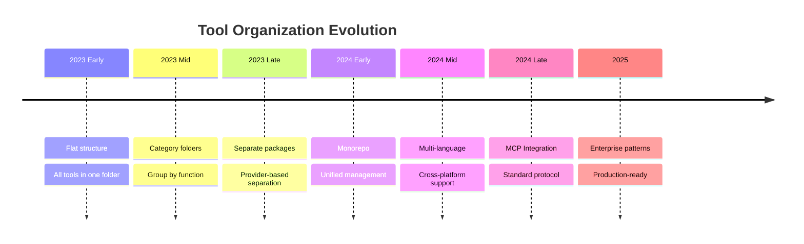

## Decision Tree

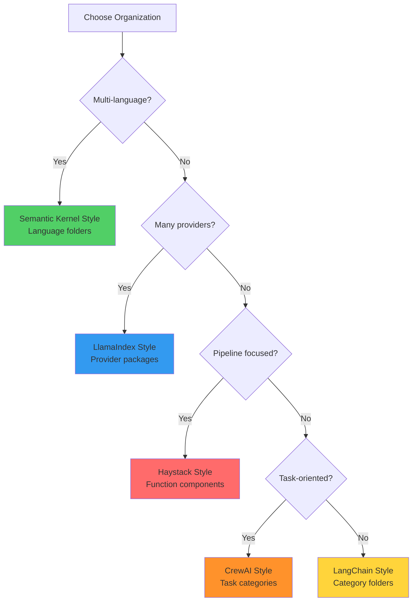

## Migration Paths

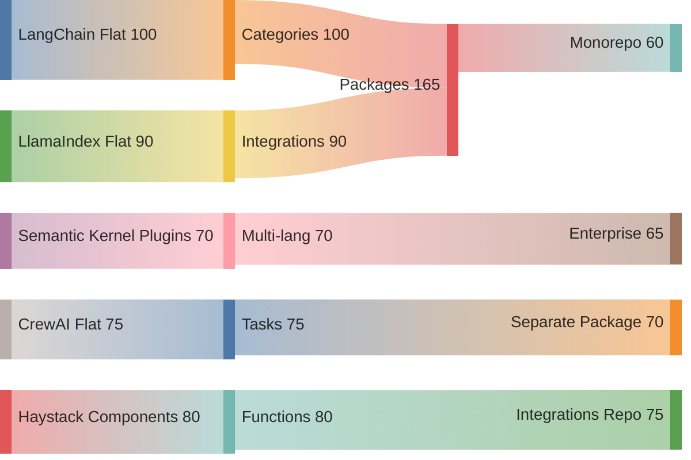

## Key Takeaways

### Pattern Distribution

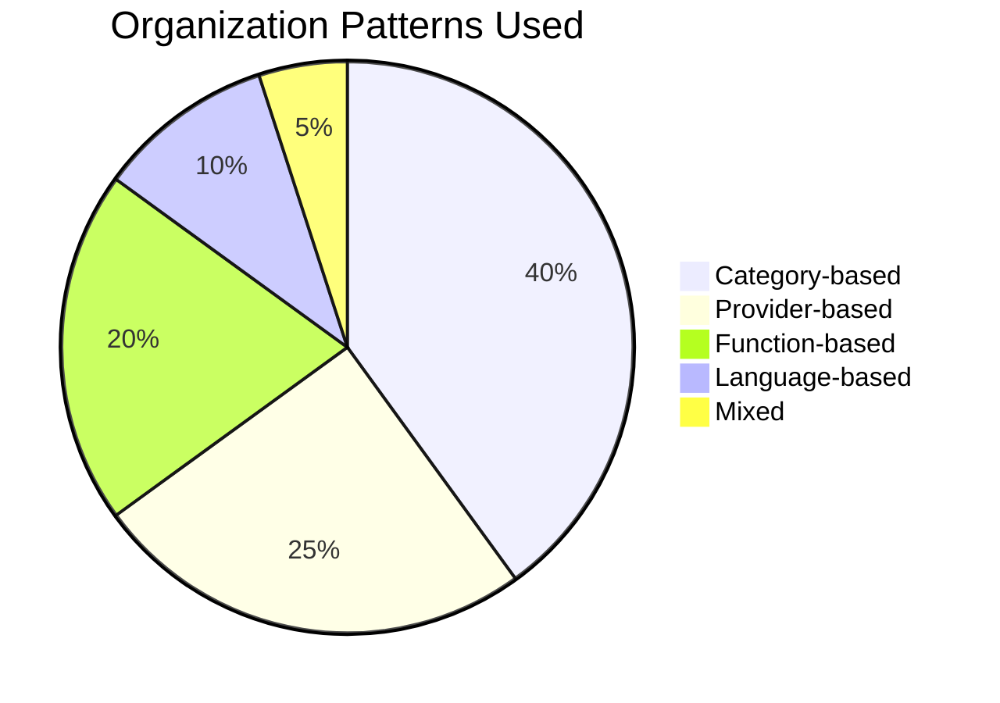

### Terminology Usage

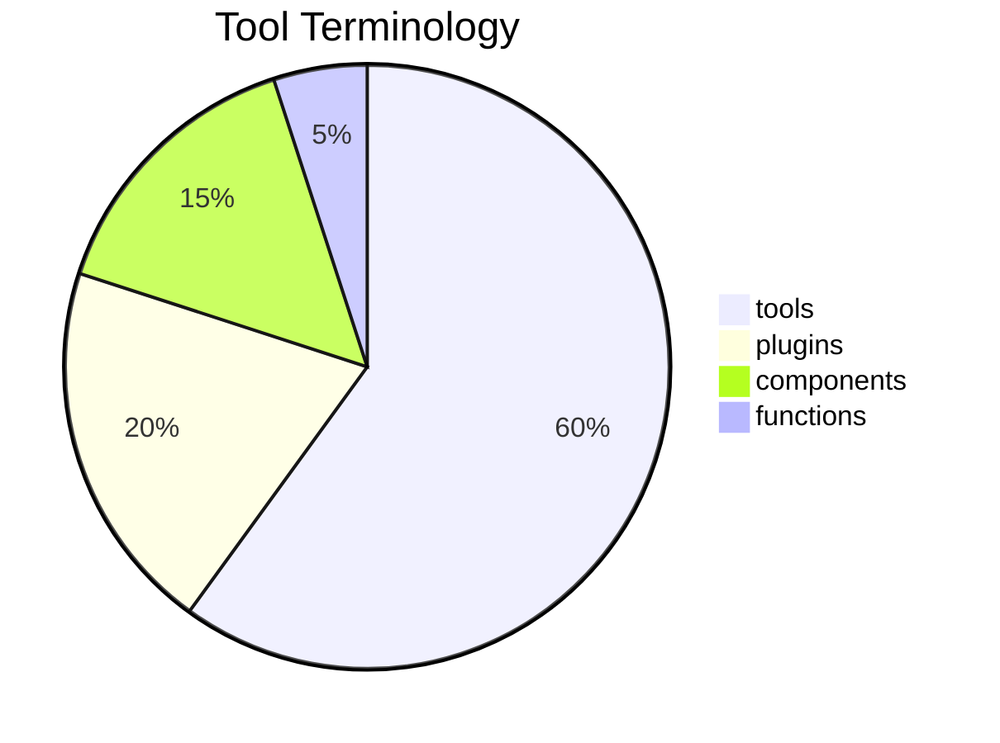

### Integration Approach

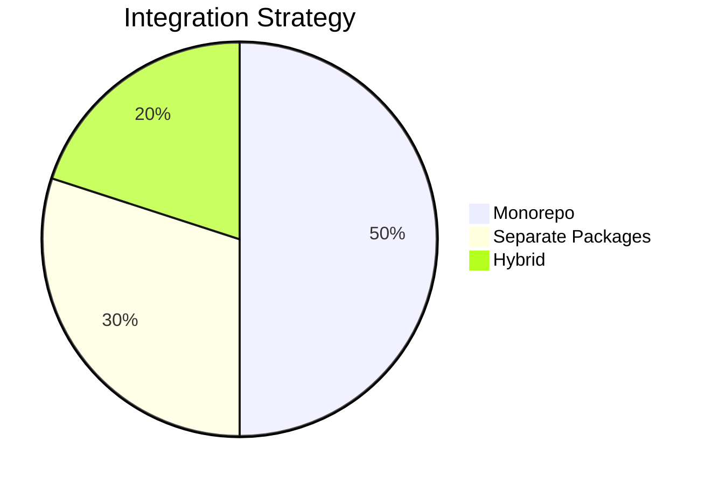
